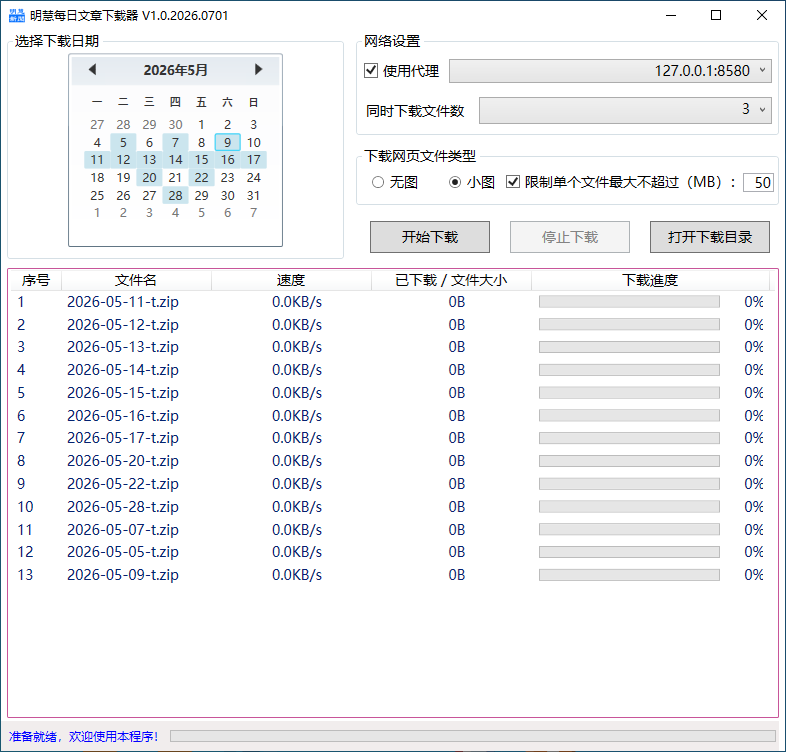
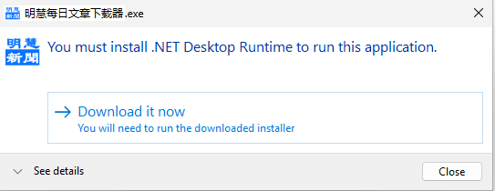
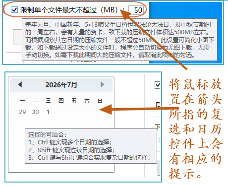
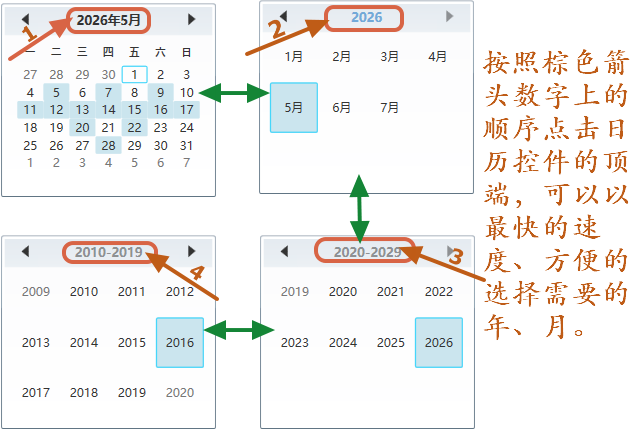
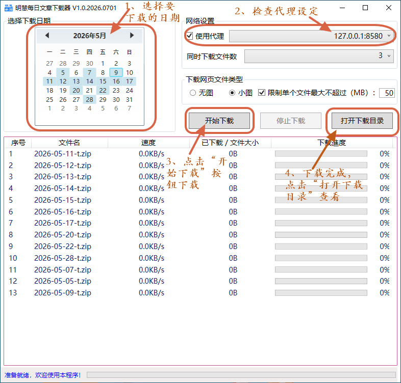

# 明慧每日文章下载器

## 一、功能簡介

本專案為了方便快速下載明慧每日文章，广传真相和大法福音為目地的。

下載源為移動版明慧网（m.minghui.org）提供的每日新聞壓縮文件（小圖或無圖）為資料源，充分利用壓縮文件體積小、下载速度快的優勢。

使用和操作簡單，一次可以同時下載多日文章，且若未下載完成，可記憶上次下載位置，下次繼續從中斷处下載。

下載完成后，程序會自動解壓縮，並按年月歸類，同時對文件名做必要的調整，以使文件在文件管理器裏顯示時，能按日期順序依次排序顯示。

 
## 二、開發環境等

|  類別  |說明|
| :---   | :---        |
|開發工具	|VS2022 社區版|
|語言|C#|
|DotNet|8.0|
|Nuget引用庫|System.IO.Compression.ZipFile, Newtonsoft.Json|
|添加且修改的專案|Downloader，根據代碼需要做了適當修改|

## 三、使用前的準備

使用前程式需要做好的準備： 

安裝微軟net Core8的桌上出版程式運行時，下載位址：
https://download.visualstudio.microsoft.com/download/pr/f18288f6-1732-415b-b577-7fb46510479a/a98239f751a7aed31bc4aa12f348a9bf/windowsdesktop-runtime-8.0.1-win-x64.exe

## 四、使用簡要說明

### 【提示】

如果系統預先沒有安裝微軟net Core8運行時，運行程序后，系統會出現下載提示，

此時，請點擊“Download it now”下載並安裝。此種情況下下載安裝的是微軟最新版的net Core8運行時。

### （一）功能提示

### （二）日历控件选择的方法

### （三）最簡只需四步即可批量下載明慧每日文章。

## 五、所使用或引用的專案

1、Downloader
https://github.com/bezzad/Downloader

### 誠心感謝作者的付出！

## 六、更新

（省略）

## 七、鄭重聲明

１、本項目僅為廣泛傳播明慧真相，讓眾人明真相所用而特別製作。

２、下載的所有内容，請尊重文章的版權（归明慧网所有），勿修改任何內容，保證其完整性。

３、對於利用所下載的文章拼接、修改等以達到其各種不善目的的，請懸崖勒馬。蒼天在上，莫要做此等壞事，害己害人，絕不可取。

４、對於下載用於廣傳真相的可貴的善良的世人，感謝您的付出！您的善舉將會給您帶來美好的未來！

